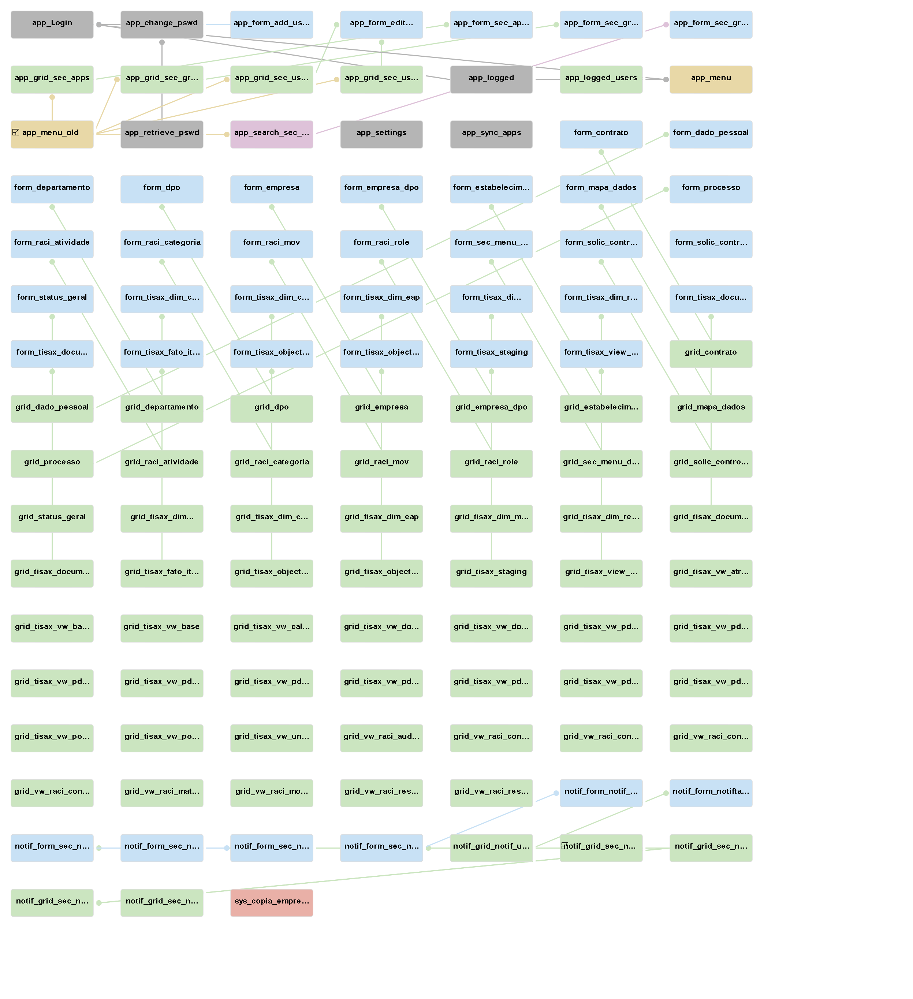
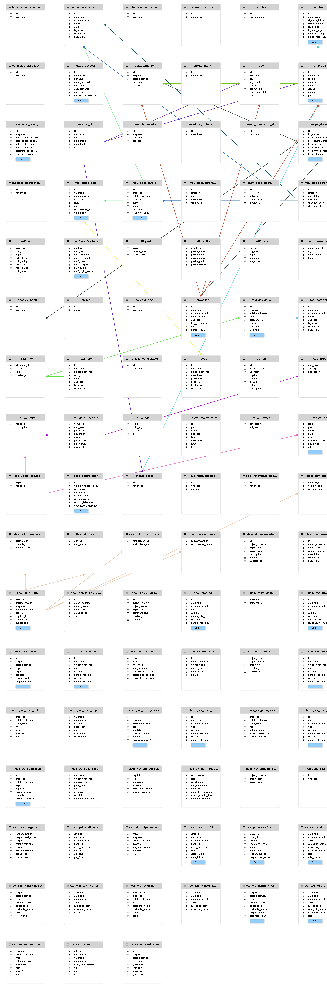

## O Projeto OpenRiskManager

O OpenRiskManager é uma aplicação desenvolvida com a finalidade de oferecer às organizações públicas e privadas uma plataforma de suporte à governança de Tecnologia da Informação (TI). Seu objetivo é prover meios para estruturar, acompanhar e monitorar requisitos de conformidade, riscos e controles de TI, alinhando-se às melhores práticas do setor.

O projeto busca atender às necessidades crescentes de gestão de riscos de segurança da informação, especialmente no contexto do setor automotivo, onde a avaliação TISAX (Trusted Information Security Assessment Exchange) se tornou referência obrigatória para fornecedores e parceiros.

## Abordagem Acadêmica

Este projeto foi desenvolvido como parte integrante da apresentação de Trabalho de Conclusão de Curso (TCC) do programa de Pós-Graduação em Governança de Tecnologia da Informação da Unicamp.

A fundamentação do OpenRiskManager atende às diretrizes metodológicas estabelecidas no curso, incluindo mas não se limitando:

  -Desenvolvimento de uma prova de conceito aplicada;
  
  -Estruturação em alinhamento com frameworks de governança e segurança da informação;
  
  -Uso de ferramentas inovadoras de desenvolvimento (LowCode/NoCode);
  
  -Contribuição prática e científica para o campo da Governança de TI.

## Tecnologias e Ferramentas Utilizadas

- ScriptCase – framework LowCode para desenvolvimento rápido de aplicações.
- Servidor Web Apache.
- Framework PHP 8.1.
- MariaDB – banco de dados relacional open source, robusto e escalável.
- Normas de referência – ISO 27001, COBIT, ITIL, além do modelo de avaliação TISAX.
- GitHub.
- Microsoft Visual Code.
- Putty.
- WinSCP.
- Bizzagi.
- Draw.io

## Status do Projeto

 - Levantamento de requisitos - OK
 - Modelagem conceitual e arquitetura - OK
 - Prova de conceito funcional - Em Curso
 - Validação em ambiente organizacional real - Em Curso

## Licença

Este projeto é disponibilizado sob a licença MIT License, permitindo livre uso, modificação e distribuição, desde que preservados os créditos de autoria.

## Modelo Relacional Banco de dados 1

*Fonte: Elaboração própria (2025).*

## Modelo Relacional Banco de dados 2

*Fonte: Elaboração própria (2025).*
